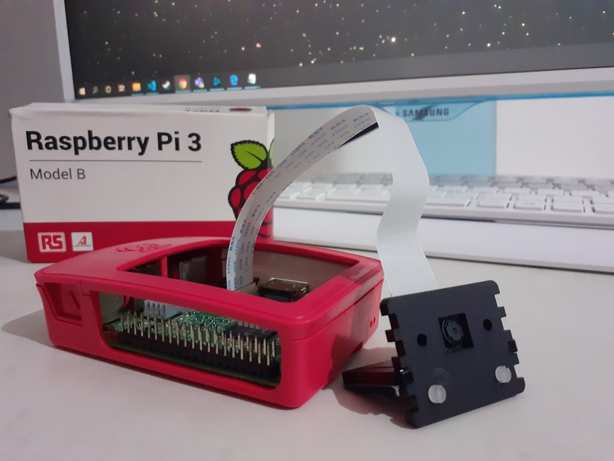
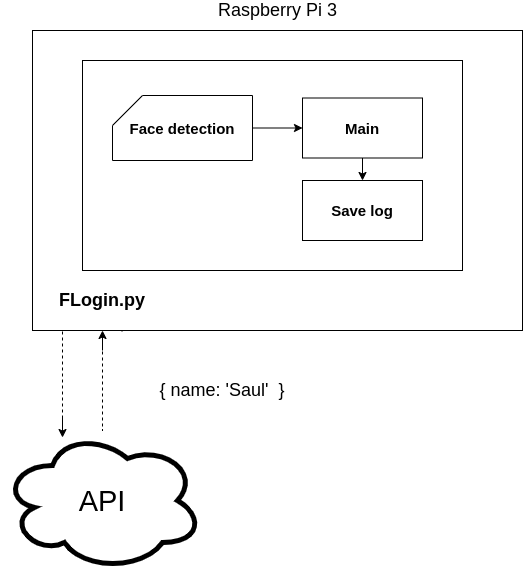
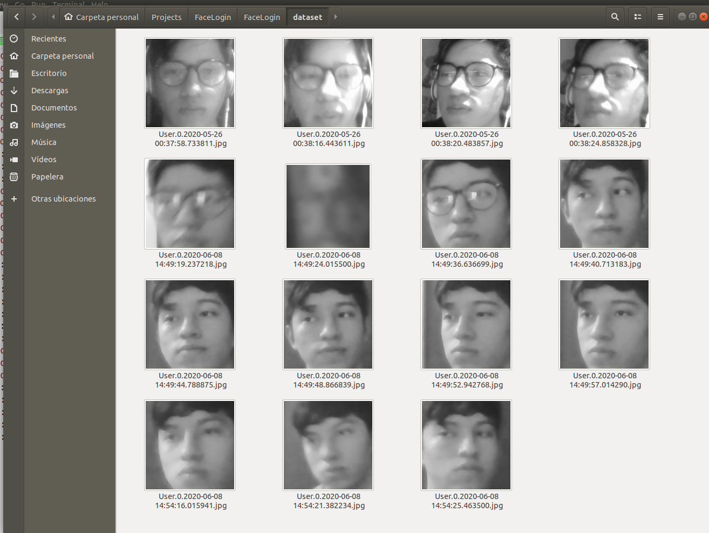
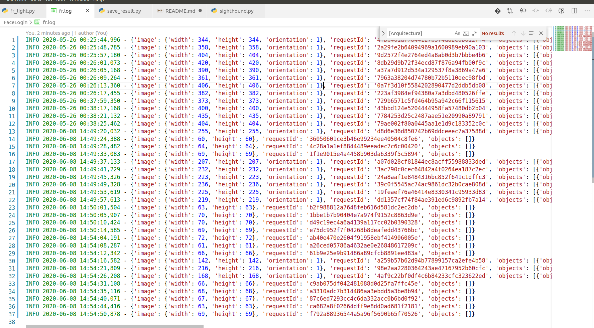
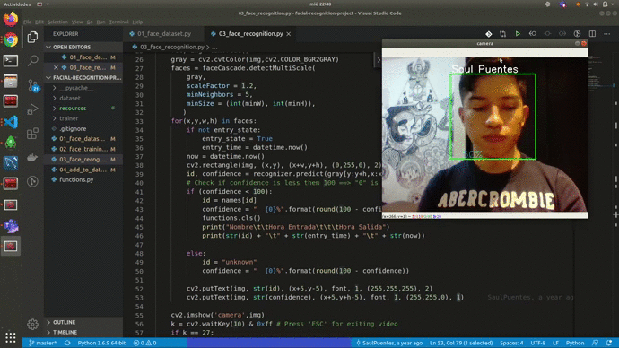

## Face Login

**Código del proyecto:** https://github.com/SaulPuentes/FaceLogin

### 1. Propuesta de proyecto
- **Objetivo del proyecto**
El objetivo del proyecto es crear un sistema que detecte las entradas y salidas del personal utilizando reconocimiento facial, teniendo un registro con la hora exacta de entrada, además de permitir al usuario gestionar los *datasets* que entrenarán el modelo de machine learning.

- **Alcance del proyecto**
El alcance del proyecto será que la aplicación debe poder reconocer a las personas de un grupo, además de poder gestionar ese grupo ya sea agregando, modificando o eliminando las imágenes utilizadas por el algoritmo. 

- **Actividad de cada integrante**
El responsable de todo el proyecto será Saúl Alejandro Puentes Zarzosa.

 

### 2. Investigación de Proyectos relacionados
- **Real-Time Face Recognition: An End-To-End Project**
Es un proyecto que utiliza una Raspberry Pi 3, una camará y la librería de código abierto OpenCV para hacer reconocimiento facial en tiempo real. El proyecto consta de 3 fases:
  - Detección de rostros y recopilación de datos
  - Entrenar al Reconocedor
  - Reconocimiento facial
 
- **Realtime Face Recognition in the Browser**
Un proyecto que utiliza tecnologías de Javascript para hacer una aplicación web que puede hacer reconocimiento facial desde un navegador. Además de contar con una interfaz que permite entrenar al modelo de predicción.

**Bibliografias**
- Marcelo Rovai. (2018). Real-Time Face Recognition: An End-To-End Project. 2020, de FIME Sitio web: https://towardsdatascience.com/real-time-face-recognition-an-end-to-end-project-b738bb0f7348
- Goran Jovanov. (2019). Realtime Face Recognition in the Browser. 2020, de FIME Sitio web: https://medium.com/@gjovanov/realtime-face-recognition-de1ee3076878
 

### 3. Técnicas de análisis de información / Algoritmos a utilizar
- **Aprendizaje supervisado**
  El aprendizaje supervisado nos servirá para entrenar nuestro algoritmo con las imágenes de los usuarios que queremos que reconozca.
 

### 4. Diagramas de procesos
- **Arquitectura de la aplicación**

- **Face Detection**

- **API Request**

- **Guardar registro**

### 5. Agentes a utilizar (secuencia de percepciones y acciones a realizar)
- **Haar Cascade Classifier**
  Es un método de detección de objetos efectivo propuesto por Paul Viola y Michael Jones en su artículo, "Rapid Object Detection using a Boosted Cascade of Simple Features" en 2001. Es un enfoque basado en el aprendizaje automático donde la función en cascada se forma a partir de muchas imágenes positivas y negativas. Luego se usa para detectar objetos en otras imágenes.
**Documentación:** https://docs.opencv.org/4.1.0/d7/d8b/tutorial_py_face_detection.html
**Visualicación del algoritmo:** https://www.youtube.com/watch?v=hPCTwxF0qf4
 

### 6. Bases de datos utilizada (capturas de pantalla) / reporte de donde se esta guardando la información a analizar
Para lograr el alcance del proyecto se decidió utilizar el almacenamiento local de la raspberry donde funcionará el proyecto. Cada vez que la aplicación detecta un rostro la imagen con la hora en que fue tomada la fotografía es almacenada en una carpeta como se muestra a continuación:

 
Después de que la imagen es almacenada se envía una petición a la API de reconocimiento, esta retorna en formato JSON información que contiene el ID de la persona detectada (en caso de coincidir con alguien y tener más del 50% de confianza), vertices del contorno de la cara, entre otros datos, para ser almacenados en un registro con la hora en que se registro.

### 7. Avance del proyecto
Demostración del algoritmo de detección facial en tiempo real.

 
Demostración del algoritmo de reconocimiento facial con OpenCV.

### 10. Conclusiones
Las investigaciones en la rama de la Inteligencia Artificial llevan casi 70 años desde que se acuño el término pero gracias a la capacidad de procesamiento de la era contemporánea técnicas como el *Machine learning* y las Redes neuronales han crecido en popularidad.

Herramientas como OpenCV, una librería de código abierto que incluye un gran número de algoritmos de visión computacional y ML, webservices que permiten realizar consultas a una API y obtener servicios cognitivos como el reconocimiento facial, hacen que sea más sencillo implementar estas aplicaciones.

Hoy en día estos algoritmos se encuentran en un gran número de aplicaciones que utilizamos a diario, desde la predicción de las palabras del teclado, un sistema que te recomienda contenido como videos o películas según tus gustos, hasta aplicaciones que agregan filtros o mejoras al detectar rostros de personas. Estas técnicas de Inteligencia Artificial ya están siendo utilizadas por la industria técnologica y aquellas que aprovechen la capacidad de estas aplicaciones tendrán una gran ventaja competitiva.
